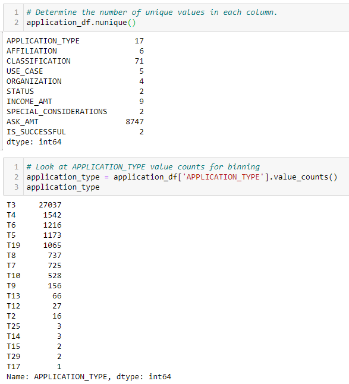

# Neural_Network_Charity_Analysis

# Overview of the analysis: 
With our knowledge of machine learning and neural networks, we used the features in a provided dataset to help Beks create a binary classifier that is capable of predicting whether applicants will be successful if funded by Alphabet Soup.

From Alphabet Soup’s business team, Beks received a CSV containing more than 34,000 organizations that have received funding from Alphabet Soup over the years. Within this dataset are a number of columns that capture metadata about each organization, such as the following:

EIN and NAME—Identification columns
APPLICATION_TYPE—Alphabet Soup application type
AFFILIATION—Affiliated sector of industry
CLASSIFICATION—Government organization classification
USE_CASE—Use case for funding
ORGANIZATION—Organization type
STATUS—Active status
INCOME_AMT—Income classification
SPECIAL_CONSIDERATIONS—Special consideration for application
ASK_AMT—Funding amount requested
IS_SUCCESSFUL—Was the money used effectively

# Results: 
Data Preprocessing

What variable(s) are considered the target(s) for your model?
We had to clean up the csv and find out what what information was actually important to us.  From the start we removed "EIN" and "NAME" as they did not bring anything to the table that we needed for this project.

What variable(s) are considered to be the features for your model?
The feature variables for this project were centered around application. Specifically we put a lot of focus on application type.

 # Compiling, Training, and Evaluating the Model:

How many neurons, layers, and activation functions did you select for your neural network model, and why?
We started out by running two layers with eighty neurons while selecting the ReLu network model.  The reason for choosing this particular mode is because the main advantage of using the ReLU function over other activation functions is that it does not activate all the neurons at the same time.

Were you able to achieve the target model performance?
We were not able to achieve the desired target of 75% performance.  He highest mark we hit was 74.02% and our average fell below that number.

# Summary:
This project helped further the knowledge and understanding of the data set we were provide.  While we did not reach our desired performance target of 75%. If we were to try and reach that target next time we may want to try another preformance model to help achieve that as the ReLU did not quite get there.
